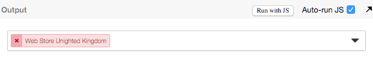
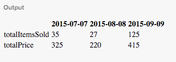

# Exercises:

### CSS

* **Reproduce this input in CSS3 this button:**

(You don't need to specify browsers vendors)



Use this link to code: http://jsbin.com/jesoxamiwe/1/edit?html,css,output (Save and send me back new link)

### JavaScript

**I. Can you give me two ways to transform:**

One of the two ways must be functional (hint: you can use ES2015 methods)

```
var start = [
  { name: 'foo', value: 'bar' },
  { name: 'save', value: 'is the best company' }
];
```

Into:

```
var end = { foo: 'bar', save: 'is the best company' };
```

**II. Write a simple sum function which produce these results:**

  * `sum(2, 3) === 5`
  * `sum(2)(3) === 5`

**III. Write a function to transform:**

```
var start = {
  '2015-07-07': [
    { totalItemsSold: 20, totalPrice: 100 },
    { totalItemsSold: 5, totalPrice: 205 },
    { totalItemsSold: 10, totalPrice: 20 }
  ],
  '2015-08-08': [
    { totalItemsSold: 5, totalPrice: 10 },
    { totalItemsSold: 10, totalPrice: 200 },
    { totalItemsSold: 12, totalPrice: 10 }
  ],
  '2015-09-09': [
    { totalItemsSold: 90, totalPrice: 300 },
    { totalItemsSold: 23, totalPrice: 15 },
    { totalItemsSold: 12, totalPrice: 100 }
  ]
};
```

Into:

```
var end = [
  [ null, '2015-07-07', '2015-08-08', '2015-09-09' ],
  [ 'totalItemsSold', 35, 27, 125 ],
  [ 'totalPrice', 325, 220, 415  ]
];
```

It must return a new object:

```
var start = { ... };
var end = computeObject(start);
console.log(start === start) // true
```

### ReactJS

**I. Write a ReactJS component which render:**

```html
<table>
  <thead>
    <tr>
      <th></th>
      <th>2015-07-07</th>
      <th>2015-08-08</th>
      <th>2015-09-09</th>
    </tr>
  </thead>
  <tbody>
    <tr>
      <td>totalItemsSold</td>
      <td>35</td>
      <td>27</td>
      <td>125</td>
    </tr>
    <tr>
      <td>totalPrice</td>
      <td>325</td>
      <td>220</td>
      <td>415</td>
    </tr>
  </tbody>
</table>
```



Use this link to code: http://jsbin.com/cesutaxapo/1/edit?html,js,output (Send me back the code only or a new snapshot).
